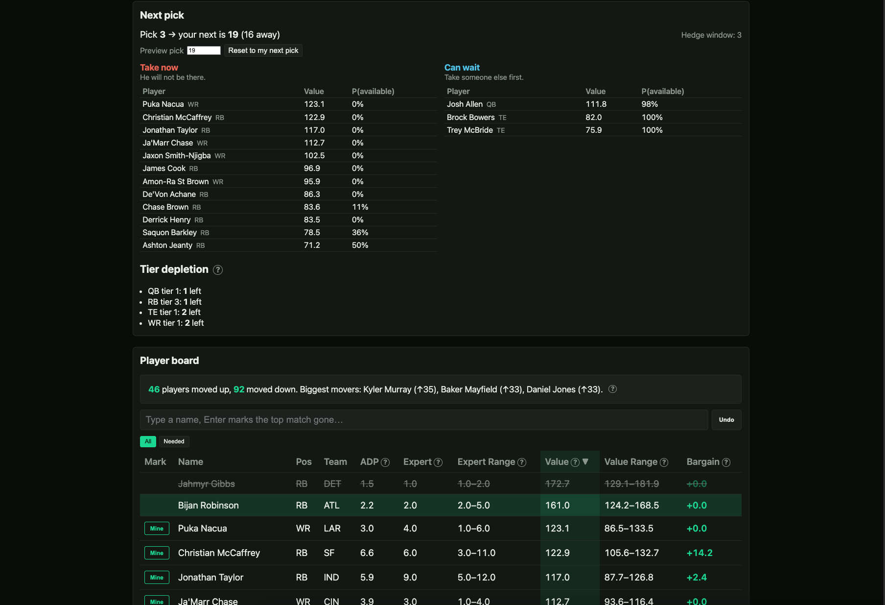

# Mispricing Engine

A parameterised fantasy football draft and season model, with a FastAPI service and a
React + TypeScript draft board on top of it. One config object drives everything —
change the league, not the code.


```python
import ffsim as ff

pool = ff.make_pool()                                   # synthetic, for now
lg   = ff.League(teams=10, slot=6, scoring=ff.Scoring.half_ppr())

summary, detail = ff.evaluate(pool, lg, ["bpa", "balanced", "ceiling"], n_sims=1000)
print(summary)
```

The full set of knobs:

```python
ff.League(teams=12, slot=3, scoring=ff.Scoring.ppr(), bench=7)
ff.League(teams=10, slot=2, lineup={"QB":1,"RB":2,"WR":3,"TE":1,"FLEX":2}, playoff_teams=6)
ff.Scoring(reception=0.5, pass_td=6.0, rec_yd=0.1)      # fully custom
```

Replacement level, tiers, positional values, the pick map, and the simulator all
recompute from that object. Nothing downstream hardcodes a league size or a
scoring rule.



_The draft view. “Take now” and “Can wait” are the probability each player
survives to your next pick — a two-piece normal around his ADP, wider on the
downside because players fall further than they rise. Arithmetic, not a
simulation, so it costs milliseconds and is always available._

---

## Why it's built this way

**Component-based scoring.** Projections are stored as receptions, yards and
touchdowns — never as fantasy point totals. Re-scoring the same pool for full
PPR is a multiply, not a re-collection. It is also why the data spec collects
component stats rather than finished point totals — a projection published as
points is already committed to someone else's scoring rules and cannot be
re-scored at all.

**Derived replacement level.** `valuation.replacement_levels` actually fills the
league's starting lineups, flex included, then takes replacement as the average
of the next three players at that position. No assumed flex split.

**Opponents that produce runs.** Real drafts cascade. A simulator without
contagion systematically concludes "you can always wait," which is the most
expensive wrong answer a draft tool can give. Opponents here respond to recent
picks, to roster need, and to their own personality vector.

**Asymmetric ADP noise.** Players fall further than they rise. A symmetric model
around an ADP of 25 essentially never produces a pick-67 outcome, and those
outcomes are exactly where value lives.

**Weekly season simulation.** Summing projected points throws away variance,
byes, injuries and the bench. Seasons run week by week instead.

**Lineups set on belief, scored on reality.** You don't pick your best player
after the fact — so the best-ball convexity argument does not apply. What you do
get is information: after a few weeks you know more than you did on draft day and
can bench what failed. That option value is the real mechanism behind a ceiling
strategy, and the waiver model is where it shows up.

**Championship equity, not total points.** H2H playoffs are a small-sample
tournament. Scoring on points alone under-recommends variance.

**Draft state survives a refresh; undo does not.** A refresh at pick 90 must not lose the
draft, so `gone`, `mine` and draft position persist to localStorage behind a versioned
reader that returns defaults for anything it doesn't recognise rather than trying to parse
it. Undo history is deliberately not persisted — losing that on refresh is fine. Draft
state and app settings use separate keys and version independently, so adding a field to
one can never wipe the other.

**Plain setState rather than functional updaters, on purpose.** Marking a player also
pushes an undo entry, and a functional updater that has to write to an undo log must mutate
something from inside the updater — which React invokes twice under StrictMode to check
purity, applying that mutation twice. Every mark and undo here is one discrete user action,
so a stale closure isn't a real risk and the simple version is the safe one.

---

## Layout

| File           | Contains                                                   |
| -------------- | ---------------------------------------------------------- |
| `config.py`    | `League`, `Scoring`, pick maps, hedge windows              |
| `scoring.py`   | component stats → points under any scoring rule            |
| `pool.py`      | player schema, validation, ceiling/risk indices            |
| `synthetic.py` | stand-in pool with realistic scarcity and market structure |
| `valuation.py` | replacement level, VOR, isotonic ADP curve, alpha, tiers   |
| `draft.py`     | snake engine, opponent personalities, drafting policies    |
| `season.py`    | weekly sim, injuries, waivers, H2H schedule, playoffs      |
| `engine.py`    | orchestration, common random numbers, objective function   |

That table is the `ffsim/` package. Alongside it, `api/` is a FastAPI service exposing the
model, and `web/` is the React + TypeScript + Vite frontend — draft board, scarcity table,
next-pick panel, a `useDraftState` hook, a typed API client, and versioned local state.

## Setup

```bash
python3 -m venv .venv && source .venv/bin/activate
pip install -r api/requirements.txt
cd web && npm install && cd ..
make dev
```

`make dev` expects `.venv/` to exist — it activates it rather than creating it.

`make test` runs the automated assertion suite. `python3 validate.py` prints hand-computed
diagnostics — pick maps, hedge windows — to read, not assert on. `make dev` runs the API and
the frontend together. `make test-open` needs `data/raw/` and carries one deliberately failing
check; see `docs/CHANGE_LEDGER.md`.

---

## Swapping in real data

Replace `make_pool()` with `ff.load_csv(path)`. Required columns:

```
player_id name position team bye_week
pass_yds pass_td interceptions rush_yds rush_td receptions rec_yds rec_td fumbles_lost
adp adp_sd adp_min adp_max
proj_games miss_rate weekly_cv proj_spread
```

Those columns are assembled by `build_pool.py` from the data workbook: a
hand-collected set of numbered source tabs — projections, ADP, injury and age
history, weekly consistency — exported one CSV per tab into the gitignored
`data/raw/`. `docs/schema_report.txt` is the full inventory of what each tab
holds. Columns map onto tabs as:

| Column                        | Source tab                                   |
| ----------------------------- | -------------------------------------------- |
| identity, bye                 | `01_PLAYERS`, `12_SCHEDULE_GRID`             |
| component stats, `proj_games` | `04_PROJECTIONS` (median across sources)     |
| `proj_spread`                 | `04_PROJECTIONS` (dispersion across sources) |
| `adp*`                        | `02_ADP`                                     |
| `miss_rate`                   | `10_RISK_INJURY_AGE`                         |
| `weekly_cv`                   | `06_WEEKLY_CONSISTENCY`                      |

---

## Current state, honestly

**Validated:** pick maps match hand computation exactly; hedge windows come out
symmetric (1,3,5,7,9,9,7,5,3,1); scoring and league-size knobs move positional
values in the right directions; positional runs occur in ~22% of five-pick
windows; availability predictions track simulated survival within ~3 points
through pick 46.

**Not yet established:** which strategy is best. At n=300 the top four presets sit
inside one standard error of each other. The model cannot currently tell them
apart, and saying otherwise would be reading noise.

**Four known limitations:**

1. **43% of `proj_spread` values are a default, not a measurement.** The pool
   estimates cross-source disagreement from a value proxy that omits passing
   stats, so quarterbacks fall through to a flat default: 41 of 41 QBs and 35 of
   50 TEs carry 0.22 or 0.29 rather than a measured dispersion, against 71 of 86
   for running backs. `proj_spread` drives `up_spread`/`down_spread` and therefore
   every ceiling and floor band in the UI, so those bands are constants for two
   positions. Known, logged in `docs/CHANGE_LEDGER.md`, not yet fixed.

2. **`up_spread` and `down_spread` are identical in every shipped pool.** The
   asymmetric-spread mechanism exists in the code and nothing currently feeds it
   different values, so the p85 and p15 bands are mirror images in practice.

3. Strategy presets are hand-set rather than searched. The parameter space
   (`ceiling_weight`, `risk_penalty`, `ev_cap`, positional bonuses) should be
   optimised directly instead of comparing named recipes.

4. **The hosted demo omits the simulator, by choice.** It runs on one shared
   vCPU, where a Monte Carlo run's wall-clock time depends on the machine's
   remaining CPU burst budget rather than on the request: 100 sims x 3
   strategies took 36.5s, while 1,000 x 1 was killed unfinished at 894.7s
   against a 121s linear prediction. The same 300-unit request measured 36.5s
   rested and over 360s after a heavy run, so no request cap can bound it.
   The Simulate tab is therefore absent from the hosted build and the endpoint
   returns 503; everything else — board, draft mode, next-pick availability —
   is unaffected, and the simulator runs normally via `make dev` or the CLI.
   Measurements and the optimisation path are in `docs/CHANGE_LEDGER.md`
   (CL-005).

**The bar before trusting recommendations:** a backtest showing the recommended
policy beats naive ADP drafting. The harness exists (`backtest.py`) and has been
run across 2021–2025 — every measurement is in `docs/TEST_LOG.md` — but it has
not cleared that bar. That is why `model_influence` ships at **Off**: the default
board is market consensus reorganised for your league, not this model's opinion.
Turning the model on is opt-in until the backtest earns it.

Every adjustment to the model, every hypothesis tested against it, and every
measurement taken lives in **`docs/CHANGE_LEDGER.md`** and **`docs/TEST_LOG.md`**.
