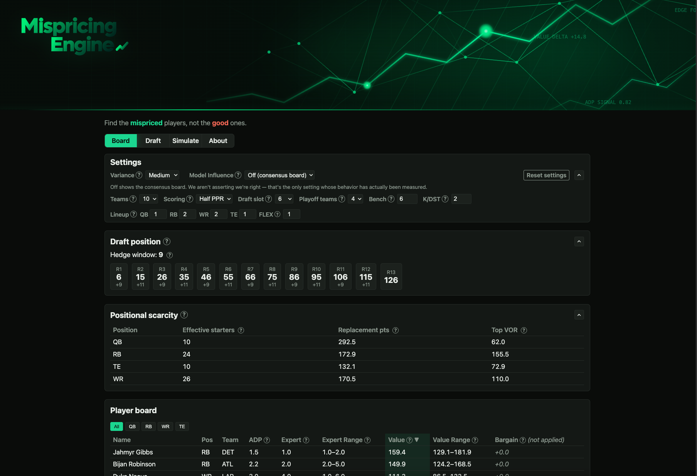

# Mispricing Engine

A parameterised fantasy football draft and season model, with a FastAPI service and a
React + TypeScript draft board on top of it. One config object drives everything —
change the league, not the code.



```python
import ffsim as ff

pool = ff.make_pool()                                   # synthetic, for now
lg   = ff.League(teams=10, slot=6, scoring=ff.Scoring.half_ppr())

summary, detail = ff.evaluate(pool, lg, ["bpa", "balanced", "ceiling"], n_sims=1000)
print(summary)
```

Every knob you asked for:

```python
ff.League(teams=12, slot=3, scoring=ff.Scoring.ppr(), bench=7)
ff.League(teams=10, slot=2, lineup={"QB":1,"RB":2,"WR":3,"TE":1,"FLEX":2}, playoff_teams=6)
ff.Scoring(reception=0.5, pass_td=6.0, rec_yd=0.1)      # fully custom
```

Replacement level, tiers, positional values, the pick map, and the simulator all
recompute from that object. Nothing downstream hardcodes a league size or a
scoring rule.

---

## Why it's built this way

**Component-based scoring.** Projections are stored as receptions, yards and
touchdowns — never as fantasy point totals. Re-scoring the same pool for full
PPR is a multiply, not a re-collection. This is why the workbook spec asks
ChatGPT for component stats.

**Derived replacement level.** `valuation.replacement_levels` actually fills the
league's starting lineups, flex included, then takes replacement as the average
of the next three players at that position. No assumed flex split.

**Opponents that produce runs.** Real drafts cascade. A simulator without
contagion systematically concludes "you can always wait," which is the most
expensive wrong answer a draft tool can give. Opponents here respond to recent
picks, to roster need, and to their own personality vector.

**Asymmetric ADP noise.** Players fall further than they rise. A symmetric model
around an ADP of 25 essentially never produces a pick-67 outcome, and those
outcomes are exactly where value lives.

**Weekly season simulation.** Summing projected points throws away variance,
byes, injuries and the bench. Seasons run week by week instead.

**Lineups set on belief, scored on reality.** You don't pick your best player
after the fact — so the best-ball convexity argument does not apply. What you do
get is information: after a few weeks you know more than you did on draft day and
can bench what failed. That option value is the real mechanism behind a ceiling
strategy, and the waiver model is where it shows up.

**Championship equity, not total points.** H2H playoffs are a small-sample
tournament. Scoring on points alone under-recommends variance.

**Draft state survives a refresh; undo does not.** A refresh at pick 90 must not lose the
draft, so `gone`, `mine` and draft position persist to localStorage behind a versioned
reader that returns defaults for anything it doesn't recognise rather than trying to parse
it. Undo history is deliberately not persisted — losing that on refresh is fine. Draft
state and app settings use separate keys and version independently, so adding a field to
one can never wipe the other.

**Plain setState rather than functional updaters, on purpose.** Marking a player also
pushes an undo entry, and a functional updater that has to write to an undo log must mutate
something from inside the updater — which React invokes twice under StrictMode to check
purity, applying that mutation twice. Every mark and undo here is one discrete user action,
so a stale closure isn't a real risk and the simple version is the safe one.

---

## Layout

| File | Contains |
|---|---|
| `config.py` | `League`, `Scoring`, pick maps, hedge windows |
| `scoring.py` | component stats → points under any scoring rule |
| `pool.py` | player schema, validation, ceiling/risk indices |
| `synthetic.py` | stand-in pool with realistic scarcity and market structure |
| `valuation.py` | replacement level, VOR, isotonic ADP curve, alpha, tiers |
| `draft.py` | snake engine, opponent personalities, drafting policies |
| `season.py` | weekly sim, injuries, waivers, H2H schedule, playoffs |
| `engine.py` | orchestration, common random numbers, objective function |

That table is the `ffsim/` package. Alongside it, `api/` is a FastAPI service exposing the
model, and `web/` is the React + TypeScript + Vite frontend — draft board, scarcity table,
next-pick panel, a `useDraftState` hook, a typed API client, and versioned local state.

`python3 validate.py` runs the full check suite. `make dev` runs the API and the frontend
together.

---

## Swapping in real data

Replace `make_pool()` with `ff.load_csv(path)`. Required columns:

```
player_id name position team bye_week
pass_yds pass_td interceptions rush_yds rush_td receptions rec_yds rec_td fumbles_lost
adp adp_sd adp_min adp_max
proj_games miss_rate weekly_cv proj_spread
```

Which maps onto the workbook tabs as:

| Column | Source tab |
|---|---|
| identity, bye | `01_PLAYERS`, `12_SCHEDULE_GRID` |
| component stats, `proj_games` | `04_PROJECTIONS` (median across sources) |
| `proj_spread` | `04_PROJECTIONS` (dispersion across sources) |
| `adp*` | `02_ADP` |
| `miss_rate` | `10_RISK_INJURY_AGE` |
| `weekly_cv` | `06_WEEKLY_CONSISTENCY` |

---

## Current state, honestly

**Validated:** pick maps match hand computation exactly; hedge windows come out
symmetric (1,3,5,7,9,9,7,5,3,1); scoring and league-size knobs move positional
values in the right directions; positional runs occur in ~22% of five-pick
windows; availability predictions track simulated survival within ~3 points
through pick 46.

**Not yet established:** which strategy is best. At n=300 the top four presets sit
inside one standard error of each other. The model cannot currently tell them
apart, and saying otherwise would be reading noise.

**Two known limitations:**

1. Synthetic upside is *mean-preserving* — wider error bars, same expectation.
   Real upside is right-skewed. A ceiling strategy has nothing genuine to buy in
   this pool, so these results understate it. Needs real `proj_spread` and
   `weekly_cv` to test properly.
2. Strategy presets are hand-set rather than searched. Once the data lands, the
   parameter space (`ceiling_weight`, `risk_penalty`, `ev_cap`, positional
   bonuses) should be optimised directly instead of comparing named recipes.

**The bar before trusting recommendations:** backtest on 2023–2025 using each
season's preseason ADP, and check that the recommended policy beat naive ADP
drafting in those years. That's what `20_ADP_OUTCOME_HISTORY` is for. If it
fails, fall back to tiers and alpha — itself a winning approach in a 10-team
league.
